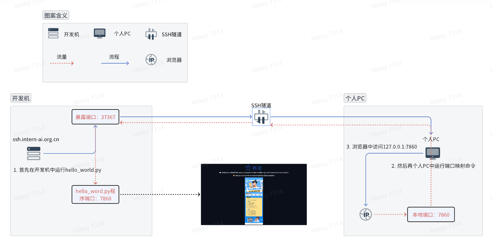

## 任务描述

完成SSH连接与端口映射并运行hello_world.py

## 配置SSH密钥进行SSH远程连接

### 1. 生成SSH密钥对：

```shell
$ ssh-keygen -t rsa
Generating public/private rsa key pair.
Enter file in which to save the key (/Users/kyeon/.ssh/id_rsa): 
/Users/kyeon/.ssh/id_rsa already exists.
Overwrite (y/n)? n 
```

由于本机已生成过ssh密钥，故执行命令以获取先前生成的密钥

```shell
$ cat ~/.ssh/id_rsa.pub 
ssh-rsa AAAAB3NzaC1yc2EAAAADAQABAAABAQCwbu8EtN4bv0iQAslHyoxoIaseunj+PZZjtlf9McdFkj32I65GTzb5ktxzdEfUC9OY9Y98pECvJQQOiEsFOso10M30Try9WbMrjsxoCj8BYl80lX9QxmuffqSCuoVoYsEw6KtN+tP6/P8rOw4YLWIiz565HmmRZGInDf6ceWNj7E3j5zh5SRmMIsP2quKLqvUaWe2aJfBEdEH9STFg8hfiqwd96WWYuakOYIkBUzBTubStbf7Gvr7siYQCH9w1Rk1bpwMNWxETkkiggbYr75yQnxHffayXvG1c/s4HbqIIFHhHZ16tibUPrIWx1tITCK049qZOWgFnuZSJ3LoVP0eh kyeon@bogon
```

将密钥粘贴至网站进行配置

### <a name="vscode-ssh-connect">2. 使用VScode进行SSH远程连接</a>

1. 打开VScode，点击左下角图标，选择SSH Remote，安装


2. 点击左下角图标，选择SSH Remote，选择配置SSH，输入网站上生成的登录命令


3. 选择配置文件


以下是生成的配置：
```shell
Host ssh.intern-ai.org.cn
  HostName ssh.intern-ai.org.cn
  Port 42168
  User root
  StrictHostKeyChecking no
  UserKnownHostsFile /dev/null
```

4. 此时会弹出已添加主机的提示，点击右下角“连接”，完成主机连接，vsCode会自动打开一个新窗口。


实战过程中发现需要下载一些东西，需要花费点儿时间，耐心等带。

5. 完成ssh远程连接


此时已完成连接，可以在资源管理器中看到远程主机的目录。

## 端口映射与运行hello_world.py

### 以下为在远程主机上创建hello_world.py的步骤：

#### 1. 创建hello_world.py

先创建一个文件夹，命名为demo，在文件夹中创建一个hello_world.py文件，内容如下：

```python
import socket
import re
import gradio as gr
 
# 获取主机名
def get_hostname():
    hostname = socket.gethostname()
    match = re.search(r'-(\d+)$', hostname)
    name = match.group(1)
    
    return name
 
# 创建 Gradio 界面
with gr.Blocks(gr.themes.Soft()) as demo:
    html_code = f"""
            <p align="center">
            <a href="https://intern-ai.org.cn/home">
                
            </a>
            </p>
            <h1 style="text-align: center;">☁️ Welcome {get_hostname()} user, welcome to the ShuSheng LLM Practical Camp Course!</h1>
            <h2 style="text-align: center;">😀 Let’s go on a journey through ShuSheng Island together.</h2>
            <p align="center">
                <a href="https://github.com/InternLM/Tutorial/blob/camp3">
                    
                </a>
            </p>

            """
    gr.Markdown(html_code)

demo.launch()
```

#### 2. 安装依赖

```shell
$ pip install gradio==4.29.0
```

#### 3. 运行代码

```shell
$ python hello_python.py
Running on local URL:  http://127.0.0.1:7860

To create a public link, set `share=True` in `launch()`.
```

此时在本地访问 http://127.0.0.1:7860/ 无法看到效果。

我们需要做端口映射才能访问到。

### 以下为在本地机器做端口映射的步骤

#### 1. [端口映射](https://github.com/Kyeoni/ShellStudy/blob/port-forwarding-2024-07-15/Internet/%E7%AB%AF%E5%8F%A3%E6%98%A0%E5%B0%84.md)

由于远程开发机所起的服务我们无法在外网进行访问，因为不知道但是我们又希望
```shell
$ ssh -p 42168 root@ssh.intern-ai.org.cn -CNg -L {本地机器_PORT}:127.0.0.1:{开发机_PORT} -o StrictHostKeyChecking=no
```
这个命令的含义是连接指定（-p）远程开发机root用户，ip地址为ssh.intern-ai.org.cn，端口为42168的服务，这台服务上{开发机_PORT端口}的请求转发到本地机器的{本地机器_PORT端口}。本地端口可指定，远程开发机应用端口就看我们刚才启动时提示我们的端口`Running on local URL:  http://127.0.0.1:7860`，即7860.

```
ssh -p 37367 root@ssh.intern-ai.org.cn -CNg -L 7860:127.0.0.1:7860 -o StrictHostKeyChecking=no

个人PC会远程连接到开发机唯一暴露在外的37367端口，（这个在SSH的时候提到过每个人的开发机暴露的端口都不一样），并设置隧道选项。暴露端口是作为中转站进行流量的转发。

-C：启用压缩，减少传输数据量。
-N：不执行远程命令，只建立隧道。
-g：允许远程主机连接到本地转发的端口。
当在个人PC上执行这个SSH命令后，SSH客户端会在本地机器的7860端口上监听。

任何发送到本地7860端口的流量，都会被SSH隧道转发到远程服务器的127.0.0.1地址上的7860端口。

这意味着，即使开发机的这个端口没有直接暴露给外部网络，我们也可以通过这个隧道安全地访问远程服务器上的服务。。
```



#### 2. 浏览器打开
浏览器打开 http://localhost:7860/ 即可访问。

浏览器中显示：


vscode中显示：
