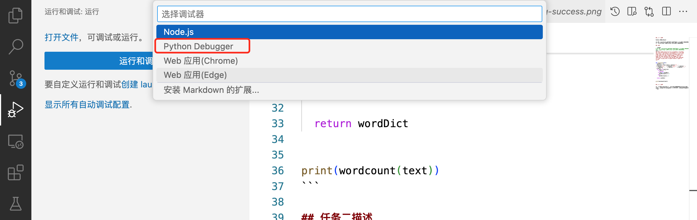

## 任务一描述

Python实现WordCount	

请实现一个wordcount函数，统计英文字符串中每个单词出现的次数。返回一个字典，key为单词，value为对应单词出现的次数。

## 实现

```python
# 请实现一个wordcount函数，统计英文字符串中每个单词出现的次数。返回一个字典，key为单词，value为对应单词出现的次数。
text = """
Got this panda plush toy for my daughter's birthday,
who loves it and takes it everywhere. It's soft and
super cute, and its face has a friendly look. It's
a bit small for what I paid though. I think there
might be other options that are bigger for the
same price. It arrived a day earlier than expected,
so I got to play with it myself before I gave it
to her.
"""

def wordcount(text):
  wordDict = {}
  word_list = text.lower().replace('\r', ' ').replace('\n', ' ').replace('\r\n', ' ').replace(',', ' ').replace('.', ' ').replace('?', ' ').replace('!', ' ').split(" ")
  for word in word_list:
    if word == '':
      continue
    if word in wordDict:
      wordDict[word] += 1
    else:
      wordDict[word] = 1

  return wordDict


print(wordcount(text))
```

## 任务二描述

请使用本地vscode连接远程开发机，将上面你写的wordcount函数在开发机上进行debug，体验debug的全流程，并完成一份debug笔记(需要截图)。

### debug单个python文件

#### 1. 什么是debug？

当你刚开始学习Python编程时，可能会遇到代码不按预期运行的情况。这时，你就需要用到“debug”了。简单来说，“debug”就是能再程序中设置中断点并支持一行一行地运行代码，观测程序中变量的变化，然后找出并修正代码中的错误。而VSCode提供了一个非常方便的debug工具，可以帮助你更容易地找到和修复错误。


#### 2. 连接开发机

[详见linux-task.md中关于使用VScode进行SSH远程连接的部分](./linux-task.md#vscode-ssh-connect)


因前期已连接过开发机，故直接点击图中图标即可进行快捷连接。
#### 3. 在本地vscode中安装Python插件


因前期已安装Python插件，如图。

#### 4. 创建Python文件

在开发机/root/demo目录下新增一个名为word_count.py的文件，并输入任务一中的代码。


#### 5. 打断点

在代码行号旁边点击，可以添加一个红点，这就是断点（如果不能添加红点需要检查一下python extension是否已经正确安装）。当代码运行到这里时，它会停下来，这样你就可以检查变量的值、执行步骤等。

#### 6. 启动debug

点击VSCode侧边栏的“Run and Debug”（运行和调试），然后点击“Run and Debug”（开始调试）按钮，或者按F5键。


单击后会需要选择debugger和debug配置文件，我们单独debug一个python文件只要选择Python File就行。然后你的代码会在达到第一个断点之前运行，在第一个断点处停下来。


#### 7. 查看变量

当代码在断点处停下来时，你可以查看和修改变量的值。在“Run and Debug”侧边栏的“Variables”（变量）部分，你可以看到当前作用域内的所有变量及其值。


```shell
$ /usr/bin/env /root/.conda/bin/python /root/.vscode-server/extensions/ms-pvthon.debuapy-2024.8.0-linux-x64/bundled/libs/debugpy/adapter/../../debugpy/launcher 43703 -- /root/demo/word_count.py
```
注意到运行时，自动生成了这样一条指令。它的含义是：

+ /usr/bin/env
  + env 命令用于运行一个程序并可以设置环境变量。
  + 在这里，env 被用来运行后续指定的 Python 解释器。
+ /root/.conda/bin/python
  + 这是一个 Python 解释器的路径。
+ /root/.vscode-server/extensions/ms-pvthon.debuapy-2024.8.0-linux-x64/bundled/libs/debugpy/adapter/../../debugpy/launcher
  + 这是 debugpy 调试工具的启动器路径。
  + 路径中的 ../../ 表示向上返回两级目录，然后进入 debugpy 目录找到 launcher
  + 这个启动器用于启动调试会话。
+ 43703
  + 这是传递给 debugpy 启动器的参数，常用于指定调试会话的端口号或其他配置参数。
+ --
  + -- 是一个常见的标志，用来表示命令选项的结束，后面的所有内容都被视为参数而不是选项。
+ /root/demo/word_count.py
  + 这是要调试的 Python 脚本的路径。

这条命令的整体功能是使用指定的 Python 解释器，通过 debugpy 调试工具启动一个调试会话，并调试给定的 Python 脚本 word_count.py。
#### 8. 单步执行代码

你可以使用“Run and Debug”侧边栏顶部的按钮来单步执行代码。这样，你可以逐行运行代码，并查看每行代码执行后的效果。


debug面板各按钮功能介绍(从左至右)：

+ 1: continue: 继续运行到下一个断点

+ 2: step over：跳过，可以理解为运行当前行代码，不进入具体的函数或者方法。

+ 3: step into: 进入函数或者方法。如果当行代码存在函数或者方法时，进入代码该函数或者方法。如果当行代码没有函数或者方法，则等价于step over。

+ 4: step out：退出函数或者方法, 返回上一层。

+ 5: restart：重新启动debug

+ 6: stop：终止debug

#### 9. 修复错误并重新运行
如果你找到了代码中的错误，可以修复它，然后重新运行debug来确保问题已经被解决。

通过遵循以上步骤，你可以使用VSCode的debug功能来更容易地找到和修复你Python代码中的错误。可以自己编写一个简单的python脚本，并尝试使用debug来更好的理解代码的运行逻辑。记住，debug是编程中非常重要的一部分，所以不要怕花时间在这上面。随着时间的推移，你会变得越来越擅长它！

### 在vscode使用命令行进行debug
很多时候我们要debug的不止是一个简单的python文件，而是很多参数，参数中不止会有简单的值还可能有错综复杂的文件关系,甚至debug一整个项目。这种情况下，直接使用命令行来发起debug会是一个更好的选择。
#### 1. vscode设置
vscode支持通过remote的方法连接我们在命令行中发起的debug server。首先我们要配置一下debug的config。

还是点击VSCode侧边栏的“Run and Debug”（运行和调试)，单击"create a lauch.json file"


选择debugger时选择python debuger。选择debug config时选择remote attach就行，随后会让我们选择debug server的地址，因为我们是在本地debug，所以全都保持默认直接回车就可以了，也就是我们的server地址为localhost:5678。




配置完以后会打开配置的json文件，但这不是重点，可以关掉。这时我们会看到run and debug界面有变化，出现了debug选项。

#### 2. 启动debug server
现在vscode已经准备就绪，让我们来看看如何在命令行中发起debug。如果没有安装debugpy的话可以先通过pip install debugpy安装一下。
```shell
$ python -m debugpy --listen5678 --wait-for-client ./demo/word_count.py
```

`./demo/word_count.py`可以替换为我们想要debug的python文件，后面可以和直接在命令行中启动python一样跟上输入的参数。记得要先在想要debug的python文件打好断点并保存。

`--wait-for-client  参数会让我们的debug server在等客户端连入后才开始运行debug。在这就是要等到我们在run and debug界面启动debug。

先在终端中发起debug server，然后再去vscode debug页面单击一下绿色箭头开启debug。

可以开始debug了，完成。

